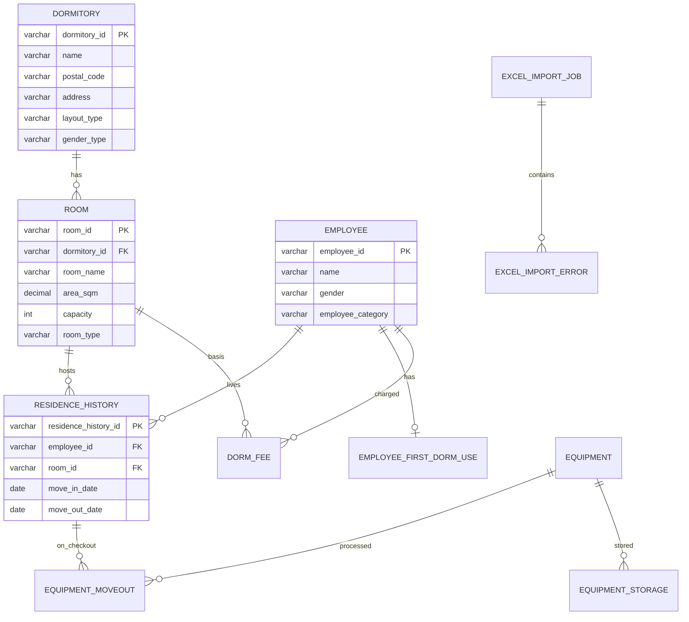

# 寮管理システム 詳細設計書

| 項目 | 内容 |
|------|------|
| 文書版 | v2.0 |
| 作成日 | 2026-05-22 |
| 最終改訂 | 2026-06-07 |
| プロジェクト名 | 寮管理システム（生成AI開発評価用） |
| 作成者 | Dev Lead / BA |
| 参照文書 | `document/RFP/寮管理システム 要件定義書（詳細版)A.docx`、`document/RFP/寮割_サンプル_A.xlsx` |

---

## 1. 概要

### 1.1 目的

本書は、要件定義書およびシステム構造図に基づき、寮管理システムの実装に必要な**機能・画面・API・データ・業務ロジック**を詳細化する。開発・単体テスト・結合テストの基準文書とする。

### 1.2 設計スコープ

| 区分 | 対象 | 備考 |
|------|------|------|
| **中心機能** | **寮割カレンダー（F-14）** | RFP A版。Excel 寮割表の Web 再現 |
| 対象 | 寮・部屋、入退寮、責任者・所属、寮費、CSV/Excel 取込、印刷、非機能 | RFP 準拠 |
| 補助機能 | 備品、空き室、初回利用日（前版継続） | 優先度 Should |
| 今回対象外 | 入居時備品準備（F-13） | マスタ・退去処理・保管は対象 |
| 拡張（DB のみ） | 連絡先・日用品費等 | UI 表示は段階導入 |

### 1.3 前提・制約

| 区分 | 内容 |
|------|------|
| 規模 | 寮約15戸、3DK中心、1戸最大3名、同時利用約20名 |
| 所在地 | 東京・大阪等（住所はマスタ管理） |
| 入居者 | 日本社員（正社員・契約）、中国出張社員 |
| 技術スタック（暫定） | フロント：React 18 + TypeScript / API：Spring Boot 3 + Java 17 / DB：PostgreSQL 15 |
| 認証 | 社内 IdP または簡易ロール認証（本番化時に確定） |
| 削除方針 | 全マスタ・履歴は**論理削除**（`deleted_at`） |
| 履歴保持 | 5年以上（アーカイブ方針は運用設計で補足） |

### 1.4 用語定義

| 用語 | 定義 |
|------|------|
| 寮割 | 月単位で寮・入居者・在籍日を一覧化。SC-01 で再現 |
| 寮（戸） | 1物件単位。地域（東京/大阪/名古屋/その他）で分類 |
| 部屋 | 寮内の個室。原則 **1部屋1名**（日単位重複不可） |
| 入居履歴 | 社員×部屋×期間（入寮日〜退寮日）。業務の中心 |
| 退寮日 NULL | 無期限入居。内部比較は `9999-12-31` 相当 |
| 責任者 | 寮ごと最大1名。★ 表示（任意） |
| 所属 | `affiliation` マスタで管理 |
| 初回利用日 | （補助）日本社員の初回寮利用日 |
| 空き室 | （補助）現在有効入居・将来予定なしの部屋 |

---

## 2. システム構成

### 2.1 論理構成

```text
[ブラウザ (React SPA)]
        │ HTTPS / JSON
        ▼
[API Gateway / Reverse Proxy]  ※本番化時
        │
        ▼
[寮管理 API (Spring Boot)]
   ├─ Presentation  (Controller)
   ├─ Application     (UseCase / Service)
   ├─ Domain          (Entity / 業務ルール)
   └─ Infrastructure  (Repository / Excel / Log)
        │
        ▼
[PostgreSQL]
```

### 2.2 パッケージ構成（バックエンド）

```text
com.example.dormitory
├── presentation      # REST Controller, DTO, バリデーション
├── application       # *Service, *UseCase（トランザクション境界）
├── domain
│   ├── dormitory     # 寮・部屋
│   ├── residence     # 入退寮・初回利用日
│   ├── fee           # 寮費算定
│   ├── equipment     # 備品
│   ├── vacancy       # 空き室
│   └── importexcel   # Excel取込
└── infrastructure    # JPA Repository, 操作ログ, ファイルストレージ
```

### 2.3 モジュール対応（構造図）

| 構造図 ID | モジュール名 | 主要 Service |
|-----------|--------------|--------------|
| 1 | 寮・部屋管理 | `DormitoryService`, `RoomService`, `PostalCodeService` |
| 2 | 入退寮管理 | `ResidenceHistoryService`, `FirstUseDateService` |
| 3 | 寮費管理 | `DormFeeCalculationService`, `DormFeeService` |
| 4 | 備品管理 | `EquipmentMasterService`, `EquipmentAssetService`, `MoveOutEquipmentService`, `EquipmentStorageService` |
| 5 | 空き室管理 | `VacancyService` |
| 6 | Excel取込 | `ExcelImportService` |
| 7 | 共通 | `OperationLogService`, `LogicalDeleteSupport` |

---

## 3. 機能一覧・要件トレーサビリティ

| 機能 ID | 機能名 | 要件参照 | 優先度 |
|---------|--------|----------|--------|
| F-01 | 寮（戸）登録・更新・参照・削除 | 4.1 | Must |
| F-02 | 部屋登録・更新・参照・削除 | 4.2 | Must |
| F-03 | 入居履歴登録・更新・退寮処理 | 5.1 | Must |
| F-04 | 初回利用日管理・通算期間算出 | 5.2 | Must |
| F-05 | 長期利用警告一覧 | 5.2 | Must |
| F-06 | 寮費算定・確定 | 6.1, 6.2 | Must |
| F-07 | 備品マスタ管理 | 7.1 | Must |
| F-08 | 退去時備品処理 | 7.3 | Must |
| F-09 | 備品保管管理 | 7.4 | Must |
| F-10 | 空き室一覧・入居可能部屋抽出 | 8.1, 8.2 | Must |
| F-11 | Excelデータ取込 | 9.x | Must |
| F-12 | 操作ログ参照 | 10 | Should |
| F-13 | 入居時備品準備 | 7.2 | **対象外** |
| **F-14** | **寮割カレンダー表示** | RFP 2.x | **Must** |
| F-15 | 寮責任者設定 | RFP 4.x | Must |
| F-16 | 退寮予定警告 | RFP 5.x | Must |
| F-17 | 入居変更履歴 | RFP 6.7 | Must |
| F-19 | 寮割帳票印刷 | RFP 10 | Should |
| F-20 | 所属マスタ管理 | RFP 6.2 | Must |
| F-21 | 社員マスタ管理 | RFP 6.2 拡張 | Must |
| F-22 | 地域マスタ管理 | RFP 2.7 | Must |
| F-23 | 利用形態マスタ管理 | 業務拡張 | Must |
| F-24 | 単価マスタ管理 | RFP 7.x | Must |

---

## 4. 画面設計

### 4.1 画面一覧

| 画面 ID | 画面名 | 主要機能 | 権限 |
|---------|--------|----------|------|
| **SC-01** | **寮割カレンダー** | **F-14 地域・月切替・黄色セル・印刷** | 一般 |
| SC-02 | 寮一覧 | F-01 検索・一覧・郵便番号→住所自動入力 | 一般 |
| SC-03 | 寮詳細 | 寮情報 + 部屋一覧 + 空き状況 | 一般 |
| SC-04 | 部屋編集 | F-02 CRUD | 管理者 |
| SC-05 | 入居履歴一覧 | F-03 検索（社員・寮・期間） | 一般 |
| SC-06 | 入居登録・退寮 | F-03, F-04 連動 | 管理者 |
| SC-07 | 初回利用日・長期利用 | F-04, F-05 | 一般 |
| SC-08 | 寮費一覧・算定 | F-06 | 管理者 |
| SC-09 | 品目マスタ | F-07 | 管理者 |
| SC-20 | 備品管理（個体） | F-10 | 管理者 |
| SC-10 | 退去備品処理 | F-08 | 管理者 |
| SC-11 | 備品保管 | F-09 | 管理者 |
| SC-12 | 空き室一覧 | F-10（性別フィルタ） | 一般 |
| SC-13 | Excel取込 | F-11 プレビュー・実行 | 管理者 |
| SC-14 | 操作ログ | F-12 | 管理者 |
| SC-15 | 所属マスタ | F-20 | 管理者 |
| SC-16 | 社員マスタ | F-21 検索・CRUD | 管理者 |
| SC-17 | 地域マスタ | F-22 | 管理者 |
| SC-18 | 利用形態マスタ | F-23 | 管理者 |
| SC-19 | 単価マスタ | F-24 | 管理者 |

### 4.2 画面遷移（概要）

```text
SC-01 ─┬─ SC-02 → SC-03 → SC-04
       ├─ SC-16 → SC-05 → SC-06
       ├─ SC-07
       ├─ SC-08
       ├─ SC-09 / SC-20 → SC-10 / SC-11
       ├─ SC-12
       └─ SC-13
```

### 4.3 主要画面項目（抜粋）

#### SC-06 入居登録・退寮

| 項目 | 入力 | 必須 | 備考 |
|------|------|------|------|
| 社員ID | 検索選択 | ○ | 社員マスタ連携（外部参照可） |
| 入居者区分 | 表示 | — | 日本社員 / 中国出張 |
| 寮 | 選択 | ○ | |
| 部屋 | 選択 | ○ | 空き・性別整合のみ選択可 |
| 入寮日 | 日付 | ○ | |
| 退寮日 | 日付 | 退寮時 | 退寮処理時入力 |
| 退寮理由 | テキスト | 任意 | |
| 初回利用日 | 表示 | — | 日本社員のみ自動設定/表示 |

**所属**: 入居登録画面では所属を選択しない（社員マスタ SC-16 で管理。v2.8）。

**画面バリデーション**：登録前に API `POST /residences/validate` で業務制約チェック（5.1）。

#### SC-02 寮一覧（新規登録・編集ダイアログ）

| 項目 | 入力 | 必須 | 備考 |
|------|------|------|------|
| 寮名称 | テキスト | ○ | |
| 郵便番号 | テキスト | ○ | 7桁。blur 時に住所自動取得 |
| 住所 | テキスト | ○ | 郵便番号から自動入力。手動修正可 |
| 間取り | 選択 | ○ | |
| 種別 | 選択 | ○ | 登録後変更不可 |
| 備考 | テキスト | 任意 | |

#### SC-12 空き室一覧

| 列 | 内容 |
|----|------|
| 寮名称 | |
| 部屋名称 | |
| ステータス | 空き / 入居中 |
| 入居者 | 入居中のみ |
| 退寮予定日 | 入居中かつ退寮日あり |
| 入居可能 | 性別フィルタ結果（○/×） |

---

## 5. API 設計

### 5.1 共通仕様

| 項目 | 仕様 |
|------|------|
| プロトコル | HTTPS, REST, JSON |
| 認証 | `Authorization: Bearer {token}`（暫定） |
| 日付形式 | ISO 8601 `YYYY-MM-DD` |
| ページング | `?page=0&size=20`（一覧系） |
| エラー | RFC 7807 風 `application/problem+json` |
| 論理削除 | DELETE は `deleted_at` 設定。GET 一覧は `deleted_at IS NULL` 既定 |

### 5.2 API 一覧

| Method | Path | 機能 ID | 概要 |
|--------|------|---------|------|
| GET | `/api/v1/dormitories` | F-01 | 寮一覧 |
| GET | `/api/v1/dormitories/{id}` | F-01 | 寮詳細 |
| POST | `/api/v1/dormitories` | F-01 | 寮登録 |
| PUT | `/api/v1/dormitories/{id}` | F-01 | 寮更新 |
| DELETE | `/api/v1/dormitories/{id}` | F-01 | 寮論理削除 |
| GET | `/api/v1/postal-codes/{postalCode}/address` | F-01 | 郵便番号から住所検索 |
| GET | `/api/v1/dormitories/{dormId}/rooms` | F-02 | 部屋一覧 |
| POST | `/api/v1/rooms` | F-02 | 部屋登録 |
| PUT | `/api/v1/rooms/{id}` | F-02 | 部屋更新 |
| DELETE | `/api/v1/rooms/{id}` | F-02 | 部屋論理削除 |
| GET | `/api/v1/residences` | F-03 | 入居履歴一覧 |
| POST | `/api/v1/residences` | F-03 | 入居登録 |
| POST | `/api/v1/residences/validate` | F-03 | 入居可否検証 |
| PUT | `/api/v1/residences/{id}/checkout` | F-03 | 退寮 |
| GET | `/api/v1/employees/{empId}/first-use-date` | F-04 | 初回利用日取得 |
| GET | `/api/v1/employees/{empId}/total-usage-days` | F-04 | 通算利用日数 |
| GET | `/api/v1/alerts/long-term-usage` | F-05 | 長期利用警告 |
| POST | `/api/v1/dorm-fees/calculate` | F-06 | 寮費算定（プレビュー） |
| GET | `/api/v1/dorm-fees` | F-06 | 寮費一覧 |
| POST | `/api/v1/dorm-fees` | F-06 | 寮費登録 |
| PUT | `/api/v1/dorm-fees/{id}/confirm` | F-06 | 寮費確定 |
| GET | `/api/v1/equipments` | F-07 | 品目マスタ一覧 |
| POST | `/api/v1/equipments` | F-07 | 品目登録 |
| GET | `/api/v1/equipment-assets` | F-10 | 備品（個体）一覧 |
| POST | `/api/v1/equipment-assets` | F-10 | 備品登録（1件） |
| PUT | `/api/v1/equipment-assets/{id}` | F-10 | 備品更新 |
| DELETE | `/api/v1/equipment-assets/{id}` | F-10 | 備品削除 |
| POST | `/api/v1/equipment-moveouts` | F-08 | 退去備品処理 |
| GET | `/api/v1/equipment-storages` | F-09 | 保管一覧 |
| POST | `/api/v1/equipment-storages` | F-09 | 保管登録 |
| GET | `/api/v1/vacancies` | F-10 | 空き室一覧 |
| GET | `/api/v1/vacancies/assignable` | F-10 | 入居可能部屋 |
| POST | `/api/v1/imports/excel/preview` | F-11 | 取込プレビュー |
| POST | `/api/v1/imports/excel/execute` | F-11 | 取込実行 |
| GET | `/api/v1/operation-logs` | F-12 | 操作ログ |
| GET | `/api/v1/dorm-allocation` | F-14 | 寮割カレンダー |
| GET | `/api/v1/alerts/move-out` | F-16 | 退寮予定警告 |
| GET | `/api/v1/dorm-allocation/print` | F-19 | 印刷データ |
| GET | `/api/v1/affiliations` | F-20 | 所属一覧 |
| PUT | `/api/v1/dormitories/{id}/manager` | F-15 | 責任者設定 |
| GET | `/api/v1/exports/csv/residences` | F-11 | 入居履歴 CSV |

### 5.3 API 詳細（代表）

#### POST `/api/v1/residences` — 入居登録

**Request**

```json
{
  "employeeId": "E00012",
  "dormitoryId": "D001",
  "roomId": "R003",
  "moveInDate": "2026-06-01",
  "moveOutDate": null,
  "moveOutReason": null
}
```

**Response 201**

```json
{
  "residenceHistoryId": "RH10045",
  "firstUseDate": "2020-04-01",
  "warnings": []
}
```

**エラー例**

| HTTP | code | 条件 |
|------|------|------|
| 400 | `RESIDENCE_OVERLAP` | 同一部屋の期間重複 |
| 400 | `GENDER_MISMATCH` | 性別と寮種別不一致 |
| 400 | `DORM_CAPACITY_EXCEEDED` | 1戸3名超過 |
| 400 | `ROOM_OCCUPIED` | 定員1名の部屋が既に入居中 |

#### POST `/api/v1/dorm-fees/calculate` — 寮費算定

**Request**

```json
{
  "employeeId": "E00012",
  "roomId": "R003",
  "targetYearMonth": "2026-06",
  "moveInDate": "2026-06-01",
  "moveOutDate": "2026-06-30"
}
```

**Response 200**

```json
{
  "amount": 28500,
  "basis": {
    "roomAreaSqm": 8.5,
    "roomType": "STANDARD",
    "billableDays": 30,
    "dailyRate": 950,
    "formula": "dailyRate * billableDays"
  }
}
```

---

## 6. データベース設計

### 6.1 ER 図（論理）



### 6.2 テーブル定義

#### 6.2.1 `dormitory`（寮マスタ）

| カラム | 型 | NULL | 説明 |
|--------|-----|------|------|
| dormitory_id | VARCHAR(20) | NO | PK |
| name | VARCHAR(100) | NO | 寮名称 |
| postal_code | VARCHAR(7) | NO | 郵便番号（7桁、ハイフンなし） |
| address | VARCHAR(200) | NO | 住所 |
| layout_type | VARCHAR(10) | NO | 間取り（3DK/2DK 等） |
| gender_type | VARCHAR(10) | NO | `MALE` / `FEMALE` |
| remarks | TEXT | YES | 備考 |
| created_at | TIMESTAMPTZ | NO | |
| updated_at | TIMESTAMPTZ | NO | |
| deleted_at | TIMESTAMPTZ | YES | 論理削除 |

**制約**：`gender_type` 変更は API 上禁止（F-01 更新時バリデーション）。

#### 6.2.2 `room`（部屋マスタ）

| カラム | 型 | NULL | 説明 |
|--------|-----|------|------|
| room_id | VARCHAR(20) | NO | PK |
| dormitory_id | VARCHAR(20) | NO | FK → dormitory |
| room_name | VARCHAR(50) | NO | 部屋名称 |
| area_sqm | DECIMAL(6,2) | NO | 面積（㎡） |
| capacity | INT | NO | 定員（既定 1） |
| room_type | VARCHAR(20) | NO | 部屋種別（寮費算定用） |
| created_at | TIMESTAMPTZ | NO | |
| updated_at | TIMESTAMPTZ | NO | |
| deleted_at | TIMESTAMPTZ | YES | |

#### 6.2.3 `employee`（社員／入居者）

| カラム | 型 | NULL | 説明 |
|--------|-----|------|------|
| employee_id | VARCHAR(20) | NO | PK |
| name | VARCHAR(100) | NO | |
| gender | VARCHAR(10) | NO | `MALE` / `FEMALE` |
| employee_category | VARCHAR(20) | NO | `JAPAN` / `CHINA_ASSIGN` |
| created_at | TIMESTAMPTZ | NO | |
| updated_at | TIMESTAMPTZ | NO | |
| deleted_at | TIMESTAMPTZ | YES | |

※ 人事システム連携前は Excel 取込・手登録で補完。

#### 6.2.4 `residence_history`（入居履歴）

| カラム | 型 | NULL | 説明 |
|--------|-----|------|------|
| residence_history_id | VARCHAR(20) | NO | PK |
| employee_id | VARCHAR(20) | NO | FK |
| dormitory_id | VARCHAR(20) | NO | FK（非正規化・検索用） |
| room_id | VARCHAR(20) | NO | FK |
| move_in_date | DATE | NO | 入寮日 |
| move_out_date | DATE | YES | 退寮日（NULL=入居中） |
| move_out_reason | VARCHAR(200) | YES | |
| created_at | TIMESTAMPTZ | NO | |
| updated_at | TIMESTAMPTZ | NO | |
| deleted_at | TIMESTAMPTZ | YES | |

**DB 制約（補助）**：`move_out_date IS NULL OR move_out_date >= move_in_date`

**期間重複防止**：アプリケーション層で排他チェック（後述 7.2.1）。PostgreSQL では `daterange` + `EXCLUDE` 制約を検討可。

#### 6.2.5 `employee_first_dorm_use`（初回利用日）

| カラム | 型 | NULL | 説明 |
|--------|-----|------|------|
| employee_id | VARCHAR(20) | NO | PK, FK |
| first_use_date | DATE | NO | 初めて寮を使用した入寮日 |
| created_at | TIMESTAMPTZ | NO | |
| updated_at | TIMESTAMPTZ | NO | |

**ルール**：`employee_category = JAPAN` のみレコード作成。既存レコードがある場合は**更新しない**。

#### 6.2.6 `dorm_fee`（寮費）

| カラム | 型 | NULL | 説明 |
|--------|-----|------|------|
| dorm_fee_id | VARCHAR(20) | NO | PK |
| employee_id | VARCHAR(20) | NO | FK |
| room_id | VARCHAR(20) | NO | FK |
| target_year_month | CHAR(7) | NO | `YYYY-MM` |
| amount | DECIMAL(10,0) | NO | 算出金額 |
| basis_area_sqm | DECIMAL(6,2) | NO | 算出根拠：面積 |
| basis_days | INT | NO | 算出根拠：日数 |
| basis_detail | JSONB | YES | 算定内訳 |
| status | VARCHAR(20) | NO | `DRAFT` / `CONFIRMED` |
| residence_history_id | VARCHAR(20) | YES | 紐づく入居履歴 |
| created_at | TIMESTAMPTZ | NO | |
| updated_at | TIMESTAMPTZ | NO | |
| deleted_at | TIMESTAMPTZ | YES | |

**一意制約**：`(employee_id, target_year_month, deleted_at IS NULL)` で重複登録防止。

#### 6.2.7 `equipment`（備品マスタ）

| カラム | 型 | NULL | 説明 |
|--------|-----|------|------|
| equipment_id | VARCHAR(20) | NO | PK |
| name | VARCHAR(100) | NO | |
| equipment_type | VARCHAR(30) | NO | |
| created_at | TIMESTAMPTZ | NO | |
| updated_at | TIMESTAMPTZ | NO | |
| deleted_at | TIMESTAMPTZ | YES | |

#### 6.2.7a `equipment_asset`（備品・個体）

| カラム | 型 | NULL | 説明 |
|--------|-----|------|------|
| equipment_asset_id | VARCHAR(20) | NO | PK（`EB` + yyyyMMdd + 4桁連番） |
| equipment_id | VARCHAR(20) | NO | FK → 品目マスタ |
| purchase_date | DATE | NO | 購入日 |
| purchase_amount | DECIMAL(12,0) | NO | 購入金額 |
| purchase_store | VARCHAR(100) | YES | 購入店 |
| purchase_store_contact | VARCHAR(50) | YES | 購入店連絡先 |
| purchase_store_postal_code | VARCHAR(7) | YES | 購入店郵便番号 |
| purchase_store_address | VARCHAR(500) | YES | 購入店住所 |
| warranty_expiry_date | DATE | YES | 保証期限 |
| purchase_quantity | INTEGER | NO | 購入数量（デフォルト 1） |
| remarks | TEXT | YES | 備考 |
| created_at | TIMESTAMPTZ | NO | |
| updated_at | TIMESTAMPTZ | NO | |
| deleted_at | TIMESTAMPTZ | YES | |

#### 6.2.8 `storage_location`（保管場所マスタ）

| カラム | 型 | NULL | 説明 |
|--------|-----|------|------|
| storage_location_id | VARCHAR(20) | NO | PK（`SL` プレフィックス） |
| name | VARCHAR(100) | NO | 保管場所名 |
| created_at | TIMESTAMPTZ | NO | |
| updated_at | TIMESTAMPTZ | NO | |
| deleted_at | TIMESTAMPTZ | YES | 論理削除 |

#### 6.2.9 `equipment_moveout`（退去時備品処理）

| カラム | 型 | NULL | 説明 |
|--------|-----|------|------|
| moveout_id | VARCHAR(20) | NO | PK |
| residence_history_id | VARCHAR(20) | NO | FK |
| equipment_id | VARCHAR(20) | NO | FK |
| disposition | VARCHAR(20) | NO | `DISCARD` / `STORE` / `REUSE` |
| processed_at | TIMESTAMPTZ | NO | |
| remarks | TEXT | YES | |
| created_by | VARCHAR(50) | NO | |

#### 6.2.10 `equipment_storage`（備品保管）

| カラム | 型 | NULL | 説明 |
|--------|-----|------|------|
| storage_id | VARCHAR(20) | NO | PK |
| equipment_id | VARCHAR(20) | NO | FK |
| storage_location_id | VARCHAR(20) | NO | FK → 保管場所マスタ |
| status | VARCHAR(20) | NO | `IN_STORAGE` / `REUSED` 等 |
| linked_moveout_id | VARCHAR(20) | YES | FK |
| created_at | TIMESTAMPTZ | NO | |
| updated_at | TIMESTAMPTZ | NO | |

#### 6.2.11 `operation_log`（操作ログ）

| カラム | 型 | NULL | 説明 |
|--------|-----|------|------|
| log_id | BIGSERIAL | NO | PK |
| operation_type | VARCHAR(30) | NO | 例：`RESIDENCE_CHECKIN` |
| target_table | VARCHAR(50) | NO | |
| target_id | VARCHAR(20) | NO | |
| before_value | JSONB | YES | |
| after_value | JSONB | YES | |
| operated_by | VARCHAR(50) | NO | |
| operated_at | TIMESTAMPTZ | NO | |

#### 6.2.11 `excel_import_job` / `excel_import_error`

取込ジョブ ID、ファイル名、ステータス、実行者、エラー行番号・項目・メッセージを保持。

### 6.3 インデックス方針

| テーブル | インデックス | 用途 |
|----------|--------------|------|
| residence_history | (room_id, move_in_date, move_out_date) | 重複チェック・空き室 |
| residence_history | (employee_id, move_in_date) | 社員履歴 |
| dorm_fee | (target_year_month, employee_id) | 月次一覧 |
| employee_first_dorm_use | (first_use_date) | 長期利用警告 |

---

## 7. 業務ロジック詳細

### 7.1 寮・部屋管理（モジュール 1）

#### 7.1.1 寮登録 `DormitoryService.create`

1. `postal_code` を7桁数字に正規化し必須検証
2. `gender_type` ∈ {`MALE`, `FEMALE`} を検証
3. 同一 `name` + `address` の重複警告（任意、論理削除除外）
4. 登録後、間取りに応じた部屋数の**初期部屋は手動登録**（自動生成はしない）

#### 7.1.2 郵便番号住所検索 `PostalCodeService.lookupAddress`

1. 郵便番号を7桁数字に正規化
2. zipcloud API から都道府県・市区町村・町域を取得
3. 結合した `address` を返却（SC-02 住所欄へ自動反映）

#### 7.1.3 部屋登録 `RoomService.create`

1. 親寮が存在し `deleted_at IS NULL`
2. `capacity` 既定値 1（未指定時）
3. `area_sqm` > 0

### 7.2 入退寮管理（モジュール 2）

#### 7.2.1 入居登録 `ResidenceHistoryService.register`

**処理順序**

```text
1. 社員・部屋・寮の存在確認
2. 性別整合チェック（employee.gender ↔ dormitory.gender_type）
3. 部屋定員チェック（当該期間の有効入居数 < capacity）
4. 戸定員チェック（同一 dormitory_id の当該期間入居者数 < 3）
5. 期間重複チェック（同一 room_id）
6. 入居履歴 INSERT
7. 日本社員の場合、初回利用日を設定（7.2.2）
8. 操作ログ記録
```

**期間重複判定（同一部屋）**

```sql
-- 概念クエリ：新規 [moveIn, moveOut] と既存が交差するか
existing.move_in_date <= COALESCE(new.move_out_date, '9999-12-31')
AND COALESCE(existing.move_out_date, '9999-12-31') >= new.move_in_date
AND existing.deleted_at IS NULL
```

**現在有効入居の定義**

```text
move_in_date <= 基準日
AND (move_out_date IS NULL OR move_out_date >= 基準日)
```

#### 7.2.2 初回利用日 `FirstUseDateService`

| 条件 | 動作 |
|------|------|
| `employee_category != JAPAN` | 処理スキップ |
| `employee_first_dorm_use` 未存在 | `first_use_date = move_in_date` で INSERT |
| 既存あり | **更新しない**（部屋移動・一時退寮後も保持） |

#### 7.2.3 通算利用期間

```text
通算日数 = 基準日 - first_use_date + 1
（カレンダー日。実際の入居日数合算ではなく、初回利用日基準の経過日数）
```

※ 要件「寮利用通算期間」の解釈は暫定。将来、実入居日数合算へ変更する場合は `FirstUseDateService` を差し替え可能にする。

#### 7.2.4 長期利用警告 `LongTermUsageAlertService`

| 項目 | 内容 |
|------|------|
| 対象 | 日本社員かつ `employee_first_dorm_use` あり |
| 条件 | `基準日 - first_use_date >= 3年`（1095日、閏年は暫定日数固定） |
| 出力 | 社員ID、氏名、初回利用日、経過年数、現在の寮・部屋 |
| 利用 | 退寮警告・寮費値上げ通知の**判定材料**（通知送信は将来） |

#### 7.2.5 退寮 `ResidenceHistoryService.checkout`

1. `move_out_date >= move_in_date`
2. 既に退寮済みの場合はエラー
3. UPDATE + 操作ログ

### 7.3 寮費管理（モジュール 3）

#### 7.3.1 算定ロジック `DormFeeCalculationService`

**入力**：部屋（面積・種別）、対象年月、入居期間（日割り）

**暫定算定式（研修用・パラメータ化）**

```text
月額単価 = room_area_sqm × unit_rate_per_sqm[room_type]
日額 = 月額単価 / days_in_month[target_year_month]
請求日数 = 対象月における入居期間の暦日数（日割り）
請求額 = ROUND(日額 × 請求日数)
```

| パラメータ | 管理方法 |
|------------|----------|
| `unit_rate_per_sqm` | `fee_rate_config` テーブルまたは application.yml |
| 社員区分別 | **将来拡張**：Strategy パターンで `FeeRule` 差し替え |

**請求日数（日割り）**

```text
期間開始 = MAX(move_in_date, 月初)
期間終了 = MIN(COALESCE(move_out_date, 月末), 月末)
請求日数 = 期間終了 - 期間開始 + 1（>0 の場合のみ）
```

#### 7.3.2 確定 `DormFeeService.confirm`

- `status`: `DRAFT` → `CONFIRMED`
- 確定後の金額変更は**取消＋再登録**フロー（監査性確保）
- 操作ログ必須

### 7.4 備品管理（モジュール 4）

| 機能 | 処理概要 |
|------|----------|
| マスタ CRUD | 標準 CRUD + 論理削除 |
| 備品（個体）CRUD | 品目コンボ・備品番号自動採番・購入数量・購入情報・保証期限・備考。登録は常に1件 |
| 退去処理 | 退寮済み `residence_history` に紐づけ、`disposition` を必須選択 |
| 保管 | `DISCARD` 以外で `STORE` / `REUSE` 選択時、`equipment_storage` へ連動登録可 |
| 入居時準備 | **実装しない**（API・画面なし） |

### 7.5 空き室管理（モジュール 5）

#### 7.5.1 空き室判定 `VacancyService.isVacant(roomId, asOfDate)`

```text
IF 有効な入居履歴が asOfDate 時点で存在 THEN 空きでない
ELSE IF 将来入居予定あり THEN 空きでない
  -- 将来入居: move_in_date > asOfDate の履歴が存在
ELSE 空き
```

#### 7.5.2 入居可能部屋抽出 `VacancyService.findAssignable`

**入力**：`employeeId` または `gender` + `asOfDate`

1. 空き室一覧を取得
2. `employee.gender` と `dormitory.gender_type` が一致する部屋のみ返却
3. 戸定員・部屋定員の余力がある部屋のみ（7.2.1 と同ロジック）

### 7.6 Excel データ取込（モジュール 6）

#### 7.6.1 処理フロー

```text
アップロード (.xlsx)
  → シート解析・ヘッダマッピング（設定 or 自動）
  → 行単位バリデーション
  → プレビュー API（エラー一覧 + 登録予定件数）
  → ユーザー確認
  → トランザクション一括 INSERT/UPDATE
  → ジョブ結果保存
```

#### 7.6.2 取込対象とマッピング

| Excel 論理項目 | 取込先 | 必須 |
|----------------|--------|------|
| 寮ID / 名称 / 郵便番号 / 住所 / 間取り / 種別 | dormitory | ○ |
| 部屋ID / 名称 / 面積 | room | ○ |
| 社員ID / 氏名 / 性別 / 区分 | employee | ○ |
| 入居履歴（入寮・退寮） | residence_history | ○ |
| 現在入寮日 | 最新入居の move_in_date 更新 | △ |
| 初回入寮日 | employee_first_dorm_use | △（日本社員） |
| 寮費 | dorm_fee（参考、`DRAFT`） | 任意 |

#### 7.6.3 バリデーション

| チェック | 内容 |
|----------|------|
| 形式 | 日付・数値・列挙値 |
| 必須 | マッピング定義に基づく |
| 参照整合 | 寮ID→部屋、社員存在 |
| 業務 | 7.2.1 と同一の重複・性別・定員（エラー行として返却、全体ロールバック） |

**実装**：Apache POI または uni Excel ライブラリ。ファイルサイズ上限 10MB（暫定）。

---

## 8. 非機能設計

| 区分 | 要件 | 設計方針 |
|------|------|----------|
| 性能 | 同時20名 | 一覧 API 2秒以内（95%tile）、DB コネクションプール 20 |
| 可用性 | 研修・将来本番 | 単一 AZ 構成から開始、本番化時に冗長化 |
| セキュリティ | 社内利用 | HTTPS 必須、ロールベース認可、操作ログ |
| 監査 | 5年保持 | `operation_log` + 業務テーブル論理削除で追跡 |
| バックアップ | 5年 | 日次フルバックアップ（本番化時 RPO/RTO 定義） |
| テスト | AI評価 | Service 層ユニットテスト必須、業務制約はテーブル駆動テスト |

### 8.1 操作ログ対象

| operation_type | トリガ |
|----------------|--------|
| `RESIDENCE_CHECKIN` | 入居登録 |
| `RESIDENCE_CHECKOUT` | 退寮 |
| `DORM_FEE_CONFIRM` | 寮費確定 |
| `EQUIPMENT_MOVEOUT` | 退去備品処理 |
| `EXCEL_IMPORT` | 取込実行 |

---

## 9. エラー・例外設計

### 9.1 業務エラーコード一覧

| code | HTTP | メッセージ（例） |
|------|------|------------------|
| `GENDER_MISMATCH` | 400 | 入居者の性別と寮種別が一致しません |
| `RESIDENCE_OVERLAP` | 400 | 指定期間は既に入居履歴と重複しています |
| `ROOM_OCCUPIED` | 400 | 部屋の定員を超えています |
| `DORM_CAPACITY_EXCEEDED` | 400 | 1戸あたりの入居上限（3名）を超えています |
| `DORM_GENDER_CHANGE_FORBIDDEN` | 400 | 寮種別は変更できません |
| `INVALID_POSTAL_CODE` | 400 | 郵便番号は7桁の数字で入力してください |
| `POSTAL_CODE_NOT_FOUND` | 400 | 該当する住所が見つかりません |
| `POSTAL_CODE_LOOKUP_FAILED` | 400 | 住所の自動取得に失敗しました |
| `FIRST_USE_IMMUTABLE` | 400 | 初回利用日は変更できません |
| `DORM_FEE_ALREADY_CONFIRMED` | 409 | 確定済みの寮費です |
| `IMPORT_VALIDATION_FAILED` | 422 | Excel取込の検証エラーがあります |

### 9.2 トランザクション境界

| 処理 | 境界 |
|------|------|
| 入居登録 + 初回利用日 | 同一トランザクション |
| Excel 取込実行 | 1ジョブ = 1トランザクション（全件成功 or 全件ロールバック） |
| 寮費確定 | 単一 `dorm_fee` 単位 |

---

## 10. セキュリティ設計

| 項目 | 方針 |
|------|------|
| 認証 | Bearer Token（将来：社内 SSO/OIDC） |
| 認可 | `ROLE_ADMIN`（マスタ・取込・確定）、`ROLE_USER`（参照・空き室・郵便番号検索） |
| 入力検証 | Bean Validation + 業務 Service 二重チェック |
| ファイル | xlsx のみ、MIME/拡張子検査、ウイルススキャン（本番化時） |
| 個人情報 | 社員氏名・入居履歴はアクセスログ対象 |

---

## 11. クラス設計（代表）

### 11.1 `ResidenceHistoryService`

```text
+ register(ResidenceRegisterCommand): ResidenceResult
+ checkout(String historyId, CheckoutCommand): void
+ validate(ResidenceRegisterCommand): ValidationResult
- assertNoOverlap(roomId, period)
- assertGenderMatch(employeeId, dormitoryId)
- assertDormCapacity(dormitoryId, period)
```

### 11.2 `DormFeeCalculationService`

```text
+ calculate(FeeCalculationQuery): FeeCalculationResult
- billableDays(period, yearMonth): int
- resolveUnitRate(roomType): BigDecimal
```

### 11.4 `PostalCodeService`

```text
+ lookupAddress(String postalCode): AddressLookupVO
- normalizePostalCode(String postalCode): String
```

### 11.5 `VacancyService`

```text
+ listVacancies(VacancyQuery): List<VacancyDto>
+ findAssignable(AssignableRoomQuery): List<RoomDto>
- isVacant(roomId, LocalDate): boolean
- hasFutureReservation(roomId, LocalDate): boolean
```

---

## 12. テスト観点（抜粋）

| 要件 ID | テストケース概要 |
|---------|------------------|
| 4.1 | 郵便番号7桁入力で住所が自動反映される |
| 4.1 | 不正な郵便番号（6桁等）で登録拒否 |
| 5.1 | 同一部屋の期間重複で登録拒否 |
| 5.1 | 男女混在戸への入居拒否 |
| 5.2 | 日本社員初回入居で初回利用日設定、2回目以降不変 |
| 5.2 | 中国出張社員は初回利用日レコードなし |
| 8.1 | 退寮後・次入居なしで空き判定 |
| 6.1 | 月途中入退居の日割り金額 |
| 9.3 | 必須漏れ Excel でプレビューエラー |

---

## 13. 未決事項

| # | 内容 | 影響 | 期限 | オーナー |
|---|------|------|------|----------|
| 1 | 寮費単価表（㎡単価・部屋種別係数）の確定値 | 算定結果 | 開発着手前 | 業務 |
| 2 | 通算期間の定義（経過日数 vs 実入居日合計） | 長期警告 | 要件確認 | BA |
| 3 | 社員マスタ連携方式（人事 API vs 手登録） | employee テーブル | 本番化前 | PM |
| 4 | 認証・認可基盤 | 全 API | 本番化前 | インフラ |
| 5 | 「寮費値上げ通知」の自動送信要否 | 通知機能 | 将来 | PM |
| 6 | 入居予定の明示登録要否（空き室判定の将来入居） | vacancy | 要件確認 | BA |

---

## 14. 改訂履歴

| 版 | 日付 | 変更内容 | 担当 |
|----|------|----------|------|
| v1.0 | 2026-05-22 | 初版作成（要件定義書・構造図に基づく） | Dev Lead |
| v1.1 | 2026-06-07 | 寮マスタに郵便番号追加、郵便番号→住所自動入力 API・画面反映 | Dev |
| **v2.0** | **2026-06-07** | **RFP A版に基づく全面見直し**（寮割カレンダー中心、所属・責任者・変更履歴・印刷） | BA / Dev Lead |

---

## 付録 A：要件 ID 対応表

| 要件定義書章 | 構造図 | 本書章 |
|--------------|--------|--------|
| 4 寮・部屋 | 1 | 6.2.1–2, 7.1 |
| 5 入退寮 | 2 | 6.2.4–5, 7.2 |
| 6 寮費 | 3 | 6.2.6, 7.3 |
| 7 備品 | 4 | 6.2.7–9, 7.4 |
| 8 空き室 | 5 | 7.5 |
| 9 Excel | 6 | 7.6 |
| 10 非機能 | 7 | 8 |

## 付録 B：部屋種別（暫定コード）

| code | 説明 |
|------|------|
| `STANDARD` | 標準洋室 |
| `SMALL` | 小部屋 |
| `OTHER` | その他（要マスタ整備） |
