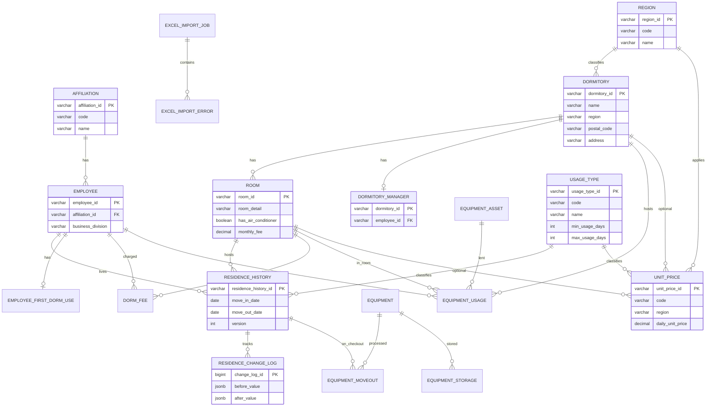

# 6. データベース設計

> 親文書: [README.md](./README.md)  
> 機能別テーブル詳細は各モジュール設計書にも抜粋記載。  
> v2.1: 地域・利用形態・単価マスタ追加（2026-06-27）。  
> v2.2: 最小/最大利用日数を `unit_price` から `usage_type` へ移管（2026-06-28）。  
> v2.4: `equipment_asset` に購入数量・備考を追加（2026-06-29）。  
> v2.5: `equipment_usage` 備品利用管理を追加（2026-06-29）。

## 6.1 ER 図（論理）

## 6.2 テーブル定義

### 6.2.1 `affiliation`（所属マスタ）

詳細: [21_責任者・所属管理.md](./21_責任者・所属管理.md#データベース)

### 6.2.2 `dormitory`（寮マスタ）

詳細: [07_寮・部屋管理.md](./07_寮・部屋管理.md#データベース)  
追加: `region`, `version`

### 6.2.3 `dormitory_manager`（寮責任者）

詳細: [21_責任者・所属管理.md](./21_責任者・所属管理.md#データベース)

### 6.2.4 `room`（部屋マスタ）

詳細: [07_寮・部屋管理.md](./07_寮・部屋管理.md#データベース)  
追加: `room_detail`, `has_air_conditioner`, `monthly_fee`, `equipment_attributes`, `version`

### 6.2.5 `employee`（社員／入居者）

詳細: [08_入退寮管理.md](./08_入退寮管理.md#データベース), [21_責任者・所属管理.md](./21_責任者・所属管理.md#データベース)  
追加: `affiliation_id`, `business_division`, `nearest_station`, `contact_info`

### 6.2.6 `residence_history`（入居履歴）

詳細: [08_入退寮管理.md](./08_入退寮管理.md#データベース)  
追加: `version`（楽観ロック）

### 6.2.7 `residence_change_log`（入居変更履歴）

詳細: [08_入退寮管理.md](./08_入退寮管理.md#データベース)

### 6.2.8 `employee_first_dorm_use`（初回利用日）

詳細: [08_入退寮管理.md](./08_入退寮管理.md#データベース)

### 6.2.9 `dorm_fee`（寮費）

詳細: [09_寮費管理.md](./09_寮費管理.md#データベース)

### 6.2.10 `equipment`（品目マスタ）

詳細: [10_備品管理.md](./10_備品管理.md#データベース)

### 6.2.10a `equipment_asset`（備品・個体）

品目マスタに紐づく個体備品。備品番号（`equipment_asset_id`）は14桁（`EB` + yyyyMMdd + 4桁連番）で自動採番。  
v2.4 より `purchase_quantity`（購入数量）・`remarks`（備考）を保持。

詳細: [10_備品管理.md](./10_備品管理.md#データベース)

### 6.2.10b `equipment_usage`（備品利用）

備品（個体）を寮・部屋・入居者に貸し出す利用履歴。利用 ID（`usage_id`）は14桁（`EU` + yyyyMMdd + 4桁連番）。  
`usage_end_date` が NULL のレコードを「利用中」とし、同一備品の利用中 `usage_quantity` 合計は `equipment_asset.purchase_quantity` を超えない（アプリ層で検証）。

詳細: [10_備品管理.md](./10_備品管理.md#データベース)

### 6.2.11 `storage_location`（保管場所マスタ）

保管場所 ID（`SL` プレフィックス）と保管場所名を管理。備品保管（`equipment_storage`）から参照。

詳細: [10_備品管理.md](./10_備品管理.md#データベース)

### 6.2.12 `equipment_moveout` / `equipment_storage`

詳細: [10_備品管理.md](./10_備品管理.md#データベース)

### 6.2.13 `operation_log`（操作ログ）

詳細: [13_操作ログ.md](./13_操作ログ.md#データベース)

### 6.2.14 `excel_import_job` / `excel_import_error` / staging

詳細: [12_Excel取込.md](./12_Excel取込.md#データベース)

### 6.2.15 `region`（地域マスタ）

詳細: [23_マスタ管理（地域・利用形態・単価）.md](./23_マスタ管理（地域・利用形態・単価）.md#データベース)

### 6.2.16 `usage_type`（利用形態マスタ）

`min_usage_days`（最小利用日数・デフォルト 1）、`max_usage_days`（最大利用日数・`-1`＝制限なし）を保持。寮費算定（F-06）の請求日数上下限に使用。

詳細: [23_マスタ管理（地域・利用形態・単価）.md](./23_マスタ管理（地域・利用形態・単価）.md#データベース)

### 6.2.17 `unit_price`（単価マスタ）

`daily_unit_price`（日単価）のみを保持。利用日数上下限は `usage_type` を参照（v2.2 より移管）。

詳細: [23_マスタ管理（地域・利用形態・単価）.md](./23_マスタ管理（地域・利用形態・単価）.md#データベース)

## 6.3 インデックス方針

| テーブル | インデックス | 用途 |
|----------|--------------|------|
| dormitory | (region, name) | 地域フィルタ・寮名ソート |
| residence_history | (room_id, move_in_date, move_out_date) | 重複チェック・カレンダー |
| residence_history | (employee_id, move_in_date) | 社員履歴 |
| residence_history | (dormitory_id, move_in_date) | 寮割カレンダー |
| residence_change_log | (residence_history_id, changed_at) | 変更履歴参照 |
| dorm_fee | (residence_history_id, target_year_month) | 入居履歴×対象月の一意 |
| affiliation | (code) | マスタ検索 |
| region | (code) | 地域コード検索・コンボボックス |
| usage_type | (code) | 利用形態コード検索 |
| unit_price | (region, usage_type_code) | 単価検索 |
| unit_price | (code) | 単価コード検索（部分一意） |
| employee | (affiliation_id) | 所属別集計 |
| storage_location | (name) WHERE deleted_at IS NULL | 保管場所名検索・一意 |
| equipment_usage | (equipment_asset_id) WHERE usage_end_date IS NULL | 利用中数量集計 |
| equipment_usage | (dormitory_id, room_id) | 寮・部屋別利用検索 |
