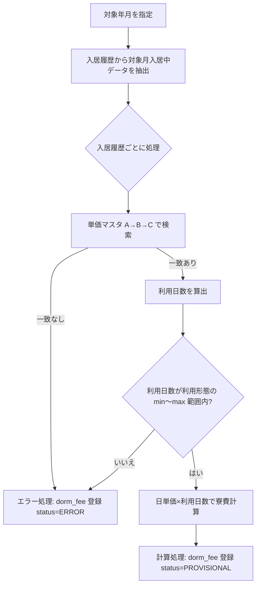

# 寮費管理（モジュール 3）


> 親文書: [README.md](./README.md)  

> 機能 ID: **F-06**  

> 要件参照: 6.1, 6.2  

> 主要 Service: `DormFeeService`


---


## 機能概要


| 機能 ID | 機能名 | 優先度 |

|---------|--------|--------|

| F-06 | 寮費算定 | Must |


**将来拡張**: 社員区分別寮費ルール（Strategy パターンで `FeeRule` 差し替え）


---


## 画面設計


| 画面 ID | 画面名 | 権限 |

|---------|--------|------|

| SC-08 | 寮費一覧・算定 | 管理者 |

### SC-08 算定ダイアログ

入力項目の表示順：**対象年月** → **寮** → **部屋** → **社員** → 入居日・退居日。

| 項目 | 連動 |
|------|------|
| 対象年月 | 必須。変更時に社員選択をクリアし、社員コンボを再取得 |
| 寮 | 変更時に部屋・社員をクリア。部屋コンボを再取得 |
| 部屋 | 寮選択後に有効。変更時に社員をクリアし、社員コンボを再取得 |
| 社員 | 対象年月が未入力の間は無効。`GET /employees` に `targetYearMonth`・`dormitoryId`・`roomId` を渡し、対象月に入居履歴がある社員のみ表示 |

**一覧テーブル列**（表示順）：番号・**地域・寮・部屋**（2行：1行目=地域、2行目=寮・部屋）・入居者・対象年月・入居日（算定期間開始日）・**退居日（入居履歴の退居日。未退居は空）**・利用形態・利用日数・日単価・金額・入居履歴・ステータス（寮費ID・単価IDは非表示）

---


## API 設計


| Method | Path | 機能 ID | 概要 |

|--------|------|---------|------|

| POST | `/api/v1/dorm-fees/calculate` | F-06 | 寮費算定（入居履歴×単価マスタ×利用形態マスタから算出・保存） |

| GET | `/api/v1/dorm-fees` | F-06 | 寮費一覧 |


### POST `/api/v1/dorm-fees/calculate` — 寮費算定


**Request**


```json

{

  "targetYearMonth": "2026-06",

  "employeeId": "E00012",

  "dormitoryId": "D001",

  "roomId": "R003",

  "moveInDate": "2026-06-01",

  "moveOutDate": "2026-06-30"

}

```


| パラメータ | 必須 | 説明 |

|------------|------|------|

| targetYearMonth | ○ | 対象年月 `YYYY-MM` |

| employeeId / dormitoryId / roomId | 任意 | 算定対象の絞込 |

| moveInDate / moveOutDate | 任意 | 算定期間の上書き（未指定時は入居履歴・対象月から算出） |


**Response 200**


複数入居履歴分の算定結果（`items`）と合計金額（`amount`）を返却する。詳細は `document/APIdoc/dormFee.md`。


---


## データベース


### `dorm_fee`（寮費）


| カラム | 型 | NULL | 説明 |

|--------|-----|------|------|

| dorm_fee_id | VARCHAR(20) | NO | PK（寮費ID） |

| region | VARCHAR(30) | NO | 地域コード |

| dormitory_id | VARCHAR(20) | NO | 寮ID |

| room_id | VARCHAR(20) | NO | 部屋ID |

| employee_id | VARCHAR(20) | NO | 入居者（社員ID） |

| target_year_month | CHAR(7) | NO | 対象年月 `YYYY-MM` |

| move_in_date | DATE | NO | 算定期間開始日（対象月内） |

| move_out_date | DATE | YES | 算定期間終了日（対象月内） |

| usage_type_code | VARCHAR(30) | NO | 利用形態コード |

| usage_days | INT | YES | 利用日数 |

| unit_price_id | VARCHAR(20) | YES | 単価ID |

| daily_unit_price | DECIMAL(10,2) | YES | 日単価 |

| amount | DECIMAL(10,0) | YES | 算出金額 |

| residence_history_id | VARCHAR(20) | NO | 入居履歴ID |

| status | VARCHAR(20) | NO | `PROVISIONAL`（仮定）/ `ERROR`（エラー） |

| created_at | TIMESTAMPTZ | NO | |

| updated_at | TIMESTAMPTZ | NO | |

| deleted_at | TIMESTAMPTZ | YES | |


**一意制約**：`(residence_history_id, target_year_month, deleted_at IS NULL)` で重複登録防止。


---


## 業務ロジック


### 7.3.1 算定フロー概要





### 7.3.2 入居履歴の抽出


対象年月において**入居中**とみなす入居履歴を抽出する。


```text

move_in_date <= 対象月末

AND (move_out_date IS NULL OR move_out_date >= 対象月初)

```


任意の検索条件（社員ID・寮ID・部屋ID）が指定された場合はさらに絞込む。


### 7.3.3 単価マスタの一致検索（A→B→C）


入居履歴ごとに、次の順序で単価マスタ（`unit_price`）を検索する。


| 順序 | 条件 | 単価行の条件 | 次の処理 |

|------|------|-------------|----------|

| **A** | 地域・利用形態・寮・部屋が一致 | `dormitory_id`・`room_id` が入居履歴と一致 | 一致→計算処理 / 不一致→B |

| **B** | 地域・利用形態・寮が一致 | `dormitory_id` が一致、`room_id IS NULL` | 一致→計算処理 / 不一致→C |

| **C** | 地域・利用形態が一致 | `dormitory_id IS NULL` かつ `room_id IS NULL` | 一致→計算処理 / 不一致→エラー処理 |


### 7.3.4 計算処理


単価が見つかった場合:


```text

開始日 = MAX(入居履歴.move_in_date, 対象月初)

終了日 = MIN(COALESCE(入居履歴.move_out_date, 対象月末), 対象月末)

利用日数 = 終了日 - 開始日 + 1

```


任意指定の `moveInDate` / `moveOutDate` がある場合は、開始日・終了日をさらに絞込む。


**利用日数の範囲チェック**（利用形態マスタ `usage_type` の `min_usage_days` / `max_usage_days` を参照）:


```text

min_usage_days <= 利用日数 <= max_usage_days（max_usage_days = -1 の場合は上限なし）

```


- **範囲内** → `請求額 = ROUND(日単価 × 利用日数)` を算出し、`dorm_fee` に登録（`status = PROVISIONAL`）

- **範囲外** → エラー処理へ


> 注: 利用日数上下限は v2.2 より利用形態マスタで管理（単価マスタには保持しない）。


### 7.3.5 エラー処理


次のいずれかの場合、`dorm_fee` にレコードを登録し `status = ERROR` とする。金額・単価は NULL。


| 条件 | エラーメッセージ例 |

|------|-------------------|

| 単価マスタ A/B/C いずれも不一致 | 合致する単価マスタがありません |

| 利用日数 < 最小利用日数 | 利用日数が最小利用日数（N日）未満です |

| 利用日数 > 最大利用日数（-1 以外） | 利用日数が最大利用日数（N日）を超過しています |

| 地域・利用形態未設定等 | 各業務メッセージ |


### 7.3.6 算定保存


- 算定成功時：`status` = `PROVISIONAL`（仮定）

- 算定失敗時：`status` = `ERROR`（エラー）

- 同一入居履歴×対象年月は再算定で上書き更新

- 操作ログ必須（`DORM_FEE_CREATE`）


---


## クラス設計


```text

DormFeeServiceImpl

+ calculate(DormFeeCalculateDTO): DormFeeCalculateVO

+ list(...): PageResult<DormFeeListView>

- buildCalculation(residence, period): CalculationContext

- resolveUnitPrice(region, dormitoryId, roomId, usageTypeCode): UnitPrice

  ↓ ResidenceHistoryMapper.findForDormFeeCalculation()  // 対象月入居中

  ↓ UnitPriceMapper.findRoomLevelMatch() / findDormitoryLevelMatch() / findRegionLevelMatch()

  ↓ UsageTypeMapper.findByCode()                        // 利用日数範囲チェック

```


詳細: [17_クラス設計.md](./17_クラス設計.md)


