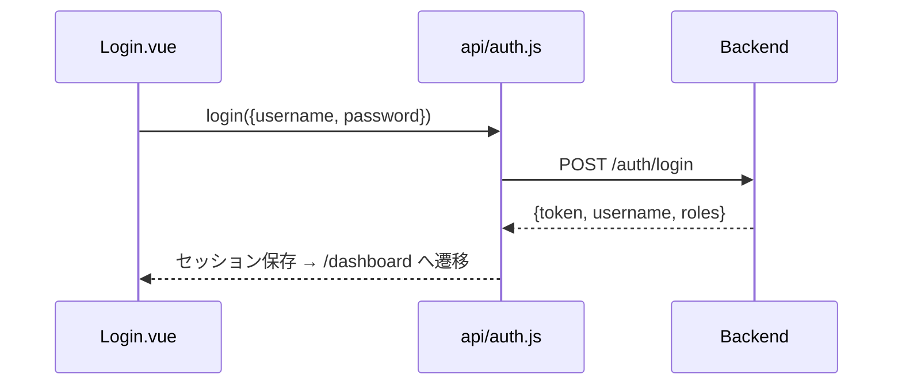

# 認証 API

> 呼び出し元: `views/login/Login.vue` → `api/auth.js`

---

## ログイン

**インターフェース名称：** ログイン  
**機能説明：** ユーザー名・パスワードで認証し、アクセストークンとロール情報を取得する  
**インターフェースURL：** `/api/v1/auth/login`  
**リクエスト方式：** POST

---

### 機能説明

ログイン画面で入力された認証情報をサーバーに送信し、成功時に JWT トークンとロール一覧を受け取る。フロントは `useUserStore.setSession()` で localStorage に保存する。



---

### リクエストパラメータ

```json
{
  "username": "admin",
  "password": "password123"
}
```

| パラメータ名 | 型 | 必須 | 説明 | 例 |
|--------------|------|------|------|------|
| username | string | はい | ユーザー名 | admin |
| password | string | はい | パスワード | password123 |

---

### レスポンスパラメータ

```json
{
  "token": "eyJhbGciOiJIUzI1NiIs...",
  "username": "admin",
  "roles": ["ROLE_ADMIN", "ROLE_USER"]
}
```

| パラメータ名 | 型 | 必須 | 説明 | 例 |
|--------------|------|------|------|------|
| token | string | はい | アクセストークン（以降 Bearer 認証に使用） | eyJhbGciOiJIUzI1NiIs... |
| username | string | いいえ | 表示用ユーザー名（未返却時はリクエスト値を使用） | admin |
| roles | string[] | いいえ | ロール一覧（`ROLE_ADMIN` / `ROLE_USER`） | ["ROLE_ADMIN"] |
