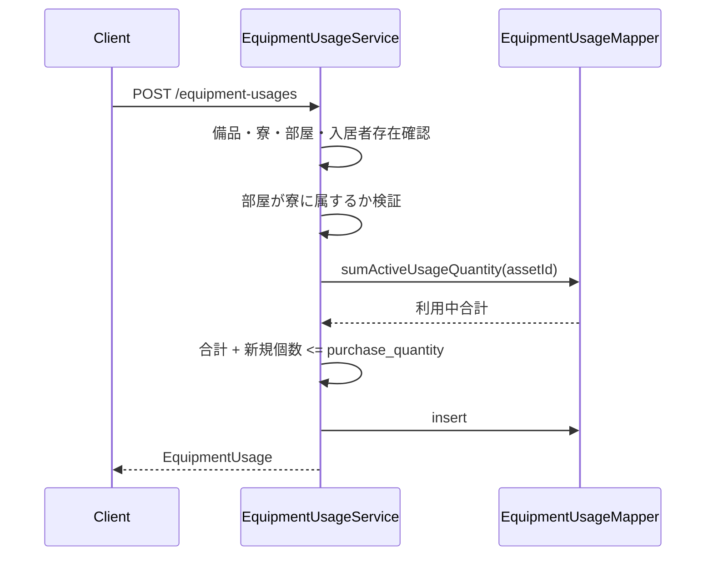

# 備品利用 API

> 呼び出し元: `views/equipment/EquipmentUsageList.vue` → `api/equipmentUsage.js`

---

## 備品利用一覧取得

**インターフェース名称：** 備品利用一覧取得  
**機能説明：** 備品利用（寮・部屋・入居者への貸出）一覧をページング取得する  
**インターフェースURL：** `/api/v1/equipment-usages`  
**リクエスト方式：** GET

---

### 機能説明

備品（個体）ごとに、どの寮・部屋・入居者がいつからいつまで何個利用しているかを一覧表示する。  
`activeOnly=true` 指定時は `usage_end_date` が NULL（利用中）のレコードのみ返却する。

---

### リクエストパラメータ

```json
{
  "equipmentAssetId": "EB202604010001",
  "dormitoryId": "D00001",
  "roomId": "R00001",
  "employeeId": "E00001",
  "activeOnly": true,
  "page": 0,
  "size": 20
}
```

| パラメータ名 | 型 | 必須 | 説明 | 例 |
|--------------|------|------|------|------|
| equipmentAssetId | string | いいえ | 備品番号絞込 | EB202604010001 |
| dormitoryId | string | いいえ | 寮 ID 絞込 | D00001 |
| roomId | string | いいえ | 部屋 ID 絞込 | R00001 |
| employeeId | string | いいえ | 入居者（社員 ID）絞込 | E00001 |
| activeOnly | boolean | いいえ | 利用中のみ（`usage_end_date` IS NULL） | true |
| page | int | いいえ | ページ番号（0 始まり） | 0 |
| size | int | いいえ | 1 ページあたり件数 | 20 |

---

### レスポンスパラメータ

```json
{
  "content": [
    {
      "usageId": "EU202606290001",
      "equipmentAssetId": "EB202604010001",
      "equipmentName": "シングルベッド",
      "purchaseQuantity": 3,
      "dormitoryId": "D00001",
      "dormitoryName": "東京寮A",
      "roomId": "R00001",
      "roomName": "101",
      "employeeId": "E00001",
      "employeeName": "山田太郎",
      "usageStartDate": "2026-06-01",
      "usageEndDate": null,
      "usageQuantity": 2,
      "remarks": null
    }
  ],
  "totalElements": 1
}
```

| パラメータ名 | 型 | 必須 | 説明 | 例 |
|--------------|------|------|------|------|
| content | object[] | はい | 利用一覧 | — |
| content[].usageId | string | はい | 利用 ID（14桁: EU + yyyyMMdd + 4桁） | EU202606290001 |
| content[].equipmentAssetId | string | はい | 備品番号 | EB202604010001 |
| content[].equipmentName | string | はい | 品目名称 | シングルベッド |
| content[].purchaseQuantity | int | はい | 備品の購入数量 | 3 |
| content[].dormitoryId | string | はい | 寮 ID | D00001 |
| content[].dormitoryName | string | はい | 寮名称 | 東京寮A |
| content[].roomId | string | はい | 部屋 ID | R00001 |
| content[].roomName | string | はい | 部屋名称 | 101 |
| content[].employeeId | string | はい | 入居者（社員 ID） | E00001 |
| content[].employeeName | string | はい | 入居者氏名 | 山田太郎 |
| content[].usageStartDate | string | はい | 利用開始日（YYYY-MM-DD） | 2026-06-01 |
| content[].usageEndDate | string | いいえ | 利用終了日（NULL＝利用中） | null |
| content[].usageQuantity | int | はい | 利用個数 | 2 |
| content[].remarks | string | いいえ | 備考 | null |
| totalElements | int | いいえ | 総件数 | 1 |

---

## 備品利用登録

**インターフェース名称：** 備品利用登録  
**機能説明：** 備品を寮・部屋・入居者に貸し出す利用レコードを登録する  
**インターフェースURL：** `/api/v1/equipment-usages`  
**リクエスト方式：** POST

---

### 機能説明

登録時、同一備品の **利用中**（`usage_end_date` IS NULL）レコードの `usage_quantity` 合計に、今回の利用個数を加えた値が、当該備品の `purchase_quantity`（購入数量）を超えないことを検証する。  
部屋は選択した寮に属していること、備品・寮・部屋・入居者が存在することを検証する。  
利用 ID は `EU` + yyyyMMdd + 4桁連番（14桁）で自動採番する。



---

### リクエストパラメータ

```json
{
  "equipmentAssetId": "EB202604010001",
  "dormitoryId": "D00001",
  "roomId": "R00001",
  "employeeId": "E00001",
  "usageStartDate": "2026-06-01",
  "usageQuantity": 2,
  "remarks": "新入居者向け"
}
```

| パラメータ名 | 型 | 必須 | 説明 | 例 |
|--------------|------|------|------|------|
| equipmentAssetId | string | はい | 備品番号 | EB202604010001 |
| dormitoryId | string | はい | 寮 ID | D00001 |
| roomId | string | はい | 部屋 ID | R00001 |
| employeeId | string | はい | 入居者（社員 ID） | E00001 |
| usageStartDate | string | はい | 利用開始日（YYYY-MM-DD） | 2026-06-01 |
| usageEndDate | string | いいえ | 利用終了日（省略時 NULL＝利用中） | null |
| usageQuantity | int | はい | 利用個数（1 以上） | 2 |
| remarks | string | いいえ | 備考（2000 文字以内） | 新入居者向け |

---

### レスポンスパラメータ

```json
{
  "usageId": "EU202606290001",
  "equipmentAssetId": "EB202604010001",
  "dormitoryId": "D00001",
  "roomId": "R00001",
  "employeeId": "E00001",
  "usageStartDate": "2026-06-01",
  "usageEndDate": null,
  "usageQuantity": 2,
  "remarks": "新入居者向け"
}
```

| パラメータ名 | 型 | 必須 | 説明 | 例 |
|--------------|------|------|------|------|
| usageId | string | はい | 利用 ID | EU202606290001 |
| equipmentAssetId | string | はい | 備品番号 | EB202604010001 |
| dormitoryId | string | はい | 寮 ID | D00001 |
| roomId | string | はい | 部屋 ID | R00001 |
| employeeId | string | はい | 入居者（社員 ID） | E00001 |
| usageStartDate | string | はい | 利用開始日 | 2026-06-01 |
| usageEndDate | string | いいえ | 利用終了日 | null |
| usageQuantity | int | はい | 利用個数 | 2 |
| remarks | string | いいえ | 備考 | 新入居者向け |

**エラー例**

| コード | 説明 |
|--------|------|
| EQUIPMENT_USAGE_QUANTITY_EXCEEDED | 利用中合計 + 新規個数が購入数量を超過 |
| ROOM_DORMITORY_MISMATCH | 部屋が選択寮に属していない |
| EQUIPMENT_ASSET_NOT_FOUND | 備品が存在しない |

---

## 備品利用解除

**インターフェース名称：** 備品利用解除  
**機能説明：** 登録済みの備品利用レコードに利用終了日を設定して利用を解除する  
**インターフェースURL：** `/api/v1/equipment-usages/{id}/release`  
**リクエスト方式：** PUT

---

### 機能説明

既存の利用レコードを更新し、`usage_end_date` を設定する（新規レコードは作成しない）。  
`usage_end_date` 未指定時は当日を設定する。既に解除済み（`usage_end_date` 設定済み）のレコードはエラーとする。

---

### リクエストパラメータ

```json
{
  "usageEndDate": "2026-06-29"
}
```

| パラメータ名 | 型 | 必須 | 説明 | 例 |
|--------------|------|------|------|------|
| usageEndDate | string | いいえ | 利用終了日（省略時は当日） | 2026-06-29 |

パスパラメータ:

| パラメータ名 | 型 | 必須 | 説明 | 例 |
|--------------|------|------|------|------|
| id | string | はい | 利用 ID | EU202606290001 |

---

### レスポンスパラメータ

```json
{
  "usageId": "EU202606290001",
  "equipmentAssetId": "EB202604010001",
  "dormitoryId": "D00001",
  "roomId": "R00001",
  "employeeId": "E00001",
  "usageStartDate": "2026-06-01",
  "usageEndDate": "2026-06-29",
  "usageQuantity": 2,
  "remarks": "新入居者向け"
}
```

| パラメータ名 | 型 | 必須 | 説明 | 例 |
|--------------|------|------|------|------|
| usageId | string | はい | 利用 ID | EU202606290001 |
| equipmentAssetId | string | はい | 備品番号 | EB202604010001 |
| dormitoryId | string | はい | 寮 ID | D00001 |
| roomId | string | はい | 部屋 ID | R00001 |
| employeeId | string | はい | 入居者（社員 ID） | E00001 |
| usageStartDate | string | はい | 利用開始日 | 2026-06-01 |
| usageEndDate | string | はい | 利用終了日 | 2026-06-29 |
| usageQuantity | int | はい | 利用個数 | 2 |
| remarks | string | いいえ | 備考 | 新入居者向け |

**エラー例**

| コード | 説明 |
|--------|------|
| EQUIPMENT_USAGE_NOT_FOUND | 利用 ID が存在しない |
| EQUIPMENT_USAGE_ALREADY_RELEASED | 既に利用解除済み |
