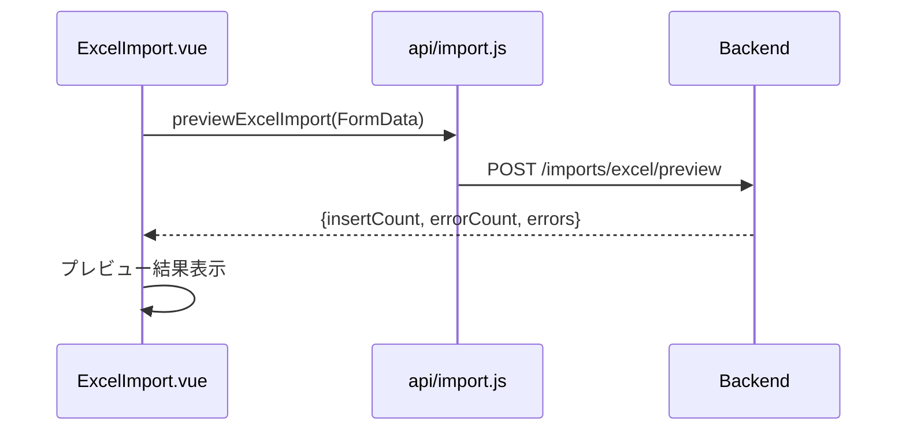

# Excel 取込 API

> 呼び出し元: `views/import/ExcelImport.vue` → `api/import.js`

---

## Excel 取込プレビュー

**インターフェース名称：** Excel 取込プレビュー  
**機能説明：** アップロードされた Excel ファイルの取込内容を検証し、プレビュー結果を返却する  
**インターフェースURL：** `/api/v1/imports/excel/preview`  
**リクエスト方式：** POST

---

### 機能説明

xlsx ファイル（最大 10MB）を multipart/form-data で送信。登録予定件数とエラー詳細を返却し、取込実行前に内容を確認する。



---

### リクエストパラメータ

**Content-Type:** `multipart/form-data`

| パラメータ名 | 型 | 必須 | 説明 | 例 |
|--------------|------|------|------|------|
| file | file | はい | xlsx 形式の Excel ファイル（最大 10MB） | import.xlsx |

---

### レスポンスパラメータ

```json
{
  "insertCount": 50,
  "totalCount": 50,
  "errorCount": 2,
  "errors": [
    {
      "rowNumber": 3,
      "field": "employeeId",
      "message": "社員IDが存在しません"
    }
  ]
}
```

| パラメータ名 | 型 | 必須 | 説明 | 例 |
|--------------|------|------|------|------|
| insertCount | int | いいえ | 登録予定件数 | 50 |
| totalCount | int | いいえ | 総件数（insertCount の代替） | 50 |
| errorCount | int | いいえ | エラー件数 | 2 |
| errors | object[] | いいえ | エラー詳細一覧 | — |
| errors[].rowNumber | int | はい | Excel 行番号 | 3 |
| errors[].field | string | いいえ | エラー項目名 | employeeId |
| errors[].message | string | はい | エラーメッセージ | 社員IDが存在しません |
| errorDetails | object[] | いいえ | エラー詳細（errors の代替フィールド名） | — |

> フロントは `data.errors || data.errorDetails` でエラー一覧を参照。

---

## Excel 取込実行

**インターフェース名称：** Excel 取込実行  
**機能説明：** プレビュー済み Excel ファイルの内容を DB に取り込む  
**インターフェースURL：** `/api/v1/imports/excel/execute`  
**リクエスト方式：** POST

---

### 機能説明

プレビュー成功後、ユーザー確認のうえ同一ファイルを再送信して取込を実行する。

---

### リクエストパラメータ

**Content-Type:** `multipart/form-data`

| パラメータ名 | 型 | 必須 | 説明 | 例 |
|--------------|------|------|------|------|
| file | file | はい | xlsx 形式の Excel ファイル（プレビューと同一） | import.xlsx |

---

### レスポンスパラメータ

フロントは成功メッセージ表示後、プレビュー結果とファイル選択をクリアする。レスポンスボディのフィールド参照はなし。
