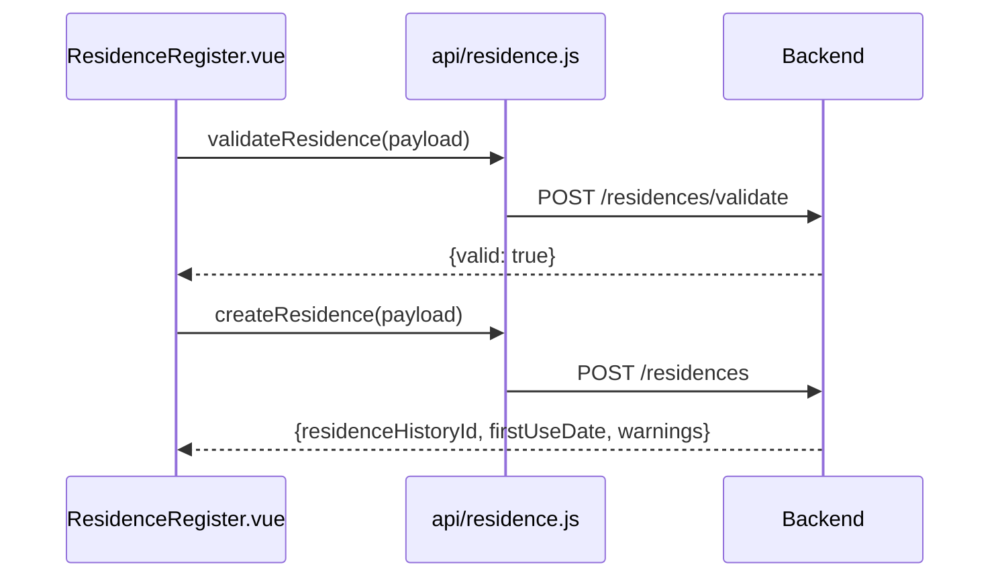

# 入退寮 API

> 呼び出し元: `views/residence/*` → `api/residence.js`

---

## 入居履歴一覧取得

**インターフェース名称：** 入居履歴一覧取得  
**機能説明：** 検索条件に基づき入居履歴をページング取得する  
**インターフェースURL：** `/api/v1/residences`  
**リクエスト方式：** GET

---

### 機能説明

入居履歴一覧画面（SC-05）の検索・表示に使用。入居登録画面では社員検索のフォールバックにも利用。

---

### リクエストパラメータ

```json
{
  "name": "山田",
  "employeeId": "E00012",
  "dormitoryName": "第一寮",
  "moveInDateFrom": "2026-01-01",
  "moveInDateTo": "2026-12-31",
  "page": 0,
  "size": 20
}
```

| パラメータ名 | 型 | 必須 | 説明 | 例 |
|--------------|------|------|------|------|
| name | string | いいえ | 入居者氏名（部分一致） | 山田 |
| employeeId | string | いいえ | 社員 ID（部分一致） | E00012 |
| dormitoryName | string | いいえ | 寮名称（部分一致） | 第一寮 |
| moveInDateFrom | string | いいえ | 入寮日（From）`YYYY-MM-DD` | 2026-01-01 |
| moveInDateTo | string | いいえ | 入寮日（To）`YYYY-MM-DD` | 2026-12-31 |
| page | int | いいえ | ページ番号（0 始まり） | 0 |
| size | int | いいえ | 1 ページあたり件数 | 20 |

---

### レスポンスパラメータ

```json
{
  "content": [
    {
      "residenceHistoryId": "RH10045",
      "employeeId": "E00012",
      "employeeName": "山田 太郎",
      "dormitoryName": "第一寮",
      "roomName": "301",
      "moveInDate": "2026-06-01",
      "moveOutDate": null,
      "moveOutReason": null
    }
  ],
  "totalElements": 1
}
```

| パラメータ名 | 型 | 必須 | 説明 | 例 |
|--------------|------|------|------|------|
| content | object[] | はい | 入居履歴一覧 | — |
| content[].residenceHistoryId | string | はい | 入居履歴 ID | RH10045 |
| content[].employeeId | string | はい | 社員 ID | E00012 |
| content[].employeeName | string | いいえ | 氏名 | 山田 太郎 |
| content[].dormitoryName | string | いいえ | 寮名称 | 第一寮 |
| content[].roomName | string | いいえ | 部屋名称 | 301 |
| content[].moveInDate | string | はい | 入寮日 | 2026-06-01 |
| content[].moveOutDate | string | いいえ | 退寮日 | null |
| content[].moveOutReason | string | いいえ | 退寮理由 | null |
| totalElements | int | いいえ | 総件数 | 1 |

---

## 入居登録

**インターフェース名称：** 入居登録  
**機能説明：** 社員の入居履歴を新規登録する  
**インターフェースURL：** `/api/v1/residences`  
**リクエスト方式：** POST

---

### 機能説明

登録前に `POST /residences/validate` で業務検証を実行。成功後に本 API を呼び出す。



---

### リクエストパラメータ

```json
{
  "employeeId": "E00012",
  "dormitoryId": "D001",
  "roomId": "R003",
  "moveInDate": "2026-06-01",
  "moveOutDate": null,
  "moveOutReason": null
}
```

| パラメータ名 | 型 | 必須 | 説明 | 例 |
|--------------|------|------|------|------|
| employeeId | string | はい | 社員 ID | E00012 |
| dormitoryId | string | はい | 寮 ID | D001 |
| roomId | string | はい | 部屋 ID | R003 |
| moveInDate | string | はい | 入寮日 `YYYY-MM-DD` | 2026-06-01 |
| moveOutDate | string | いいえ | 退寮日（新規入居時は null） | null |
| moveOutReason | string | いいえ | 退寮理由（新規入居時は null） | null |

---

### レスポンスパラメータ

```json
{
  "residenceHistoryId": "RH10045",
  "firstUseDate": "2020-04-01",
  "warnings": []
}
```

| パラメータ名 | 型 | 必須 | 説明 | 例 |
|--------------|------|------|------|------|
| residenceHistoryId | string | いいえ | 登録された入居履歴 ID | RH10045 |
| firstUseDate | string | いいえ | 初回利用日（日本社員） | 2020-04-01 |
| warnings | string[] | いいえ | 警告メッセージ一覧 | [] |

---

## 入居業務検証

**インターフェース名称：** 入居業務検証  
**機能説明：** 入居登録前に業務制約（定員・性別・期間重複等）を検証する  
**インターフェースURL：** `/api/v1/residences/validate`  
**リクエスト方式：** POST

---

### リクエストパラメータ

```json
{
  "employeeId": "E00012",
  "dormitoryId": "D001",
  "roomId": "R003",
  "moveInDate": "2026-06-01"
}
```

| パラメータ名 | 型 | 必須 | 説明 | 例 |
|--------------|------|------|------|------|
| employeeId | string | はい | 社員 ID | E00012 |
| dormitoryId | string | はい | 寮 ID | D001 |
| roomId | string | はい | 部屋 ID | R003 |
| moveInDate | string | はい | 入寮日 | 2026-06-01 |

---

### レスポンスパラメータ

```json
{
  "valid": true,
  "message": null
}
```

| パラメータ名 | 型 | 必須 | 説明 | 例 |
|--------------|------|------|------|------|
| valid | bool | はい | 検証合格フラグ | true |
| message | string | いいえ | 不合格時のメッセージ | null |

---

## 退寮処理

**インターフェース名称：** 退寮処理  
**機能説明：** 指定入居履歴に退寮日・退寮理由を設定する  
**インターフェースURL：** `/api/v1/residences/{id}/checkout`  
**リクエスト方式：** PUT

---

### リクエストパラメータ

**パス:** `id` — 入居履歴 ID

**ボディ:**

```json
{
  "moveOutDate": "2026-12-31",
  "moveOutReason": "転勤"
}
```

| パラメータ名 | 型 | 必須 | 説明 | 例 |
|--------------|------|------|------|------|
| moveOutDate | string | はい | 退寮日 `YYYY-MM-DD` | 2026-12-31 |
| moveOutReason | string | いいえ | 退寮理由 | 転勤 |

---

### レスポンスパラメータ

フロントは成功後にフォームをリセットする。

---

## 初回利用日取得

**インターフェース名称：** 初回利用日取得  
**機能説明：** 指定社員の初回利用日・入居者区分を取得する  
**インターフェースURL：** `/api/v1/employees/{empId}/first-use-date`  
**リクエスト方式：** GET

---

### 機能説明

入居登録画面の社員選択時、初回利用日・長期利用画面の社員照会に使用。

---

### リクエストパラメータ

| パラメータ名 | 型 | 必須 | 説明 | 例 |
|--------------|------|------|------|------|
| empId | string | はい | パスパラメータ：社員 ID | E00012 |

---

### レスポンスパラメータ

```json
{
  "firstUseDate": "2020-04-01",
  "employeeCategory": "JAPAN",
  "employeeName": "山田 太郎"
}
```

| パラメータ名 | 型 | 必須 | 説明 | 例 |
|--------------|------|------|------|------|
| firstUseDate | string | いいえ | 初回利用日 | 2020-04-01 |
| employeeCategory | string | いいえ | 入居者区分（`JAPAN`/`CHINA_ASSIGN`） | JAPAN |
| employeeName | string | いいえ | 氏名 | 山田 太郎 |

---

## 通算利用日数取得

**インターフェース名称：** 通算利用日数取得  
**機能説明：** 指定社員の累計寮利用日数を取得する  
**インターフェースURL：** `/api/v1/employees/{empId}/total-usage-days`  
**リクエスト方式：** GET

---

### リクエストパラメータ

| パラメータ名 | 型 | 必須 | 説明 | 例 |
|--------------|------|------|------|------|
| empId | string | はい | パスパラメータ：社員 ID | E00012 |
| page | int | いいえ | ページ番号（buildQueryParams 経由） | 0 |
| size | int | いいえ | 件数 | 20 |

---

### レスポンスパラメータ

```json
{
  "totalUsageDays": 365
}
```

| パラメータ名 | 型 | 必須 | 説明 | 例 |
|--------------|------|------|------|------|
| totalUsageDays | int | いいえ | 通算利用日数 | 365 |
| days | int | いいえ | 通算利用日数（代替フィールド名） | 365 |

> フロントは `totalUsageDays ?? days` で参照（`FirstUseLongTerm.vue`）。

---

## 長期利用警告一覧取得

**インターフェース名称：** 長期利用警告一覧取得  
**機能説明：** 長期利用に該当する入居者の警告一覧を取得する  
**インターフェースURL：** `/api/v1/alerts/long-term-usage`  
**リクエスト方式：** GET

---

### リクエストパラメータ

```json
{
  "page": 0,
  "size": 20
}
```

| パラメータ名 | 型 | 必須 | 説明 | 例 |
|--------------|------|------|------|------|
| page | int | いいえ | ページ番号（0 始まり） | 0 |
| size | int | いいえ | 1 ページあたり件数 | 20 |

---

### レスポンスパラメータ

```json
{
  "content": [
    {
      "employeeId": "E00012",
      "employeeName": "山田 太郎",
      "firstUseDate": "2015-04-01",
      "elapsedYears": 11,
      "dormitoryName": "第一寮",
      "roomName": "301"
    }
  ],
  "totalElements": 1
}
```

| パラメータ名 | 型 | 必須 | 説明 | 例 |
|--------------|------|------|------|------|
| content | object[] | はい | 警告一覧 | — |
| content[].employeeId | string | はい | 社員 ID | E00012 |
| content[].employeeName | string | いいえ | 氏名 | 山田 太郎 |
| content[].firstUseDate | string | いいえ | 初回利用日 | 2015-04-01 |
| content[].elapsedYears | int | いいえ | 経過年数 | 11 |
| content[].dormitoryName | string | いいえ | 現在の寮 | 第一寮 |
| content[].roomName | string | いいえ | 部屋 | 301 |
| totalElements | int | いいえ | 総件数 | 1 |
