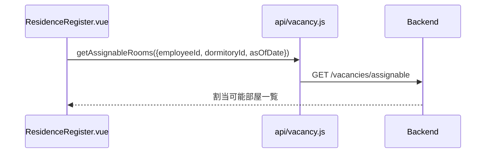

# 空き室 API

> 呼び出し元: `views/vacancy/VacancyList.vue`, `views/residence/ResidenceRegister.vue` → `api/vacancy.js`

---

## 空き室一覧取得

**インターフェース名称：** 空き室一覧取得  
**機能説明：** 種別・基準日条件で空き室状況一覧を取得する  
**インターフェースURL：** `/api/v1/vacancies`  
**リクエスト方式：** GET

---

### 機能説明

空き室一覧画面（SC-12）で各部屋の空き状況・入居可能フラグを表示する。寮名称は `dormitoryId` 付きで返却し、フロントから寮詳細へリンクする。

---

### リクエストパラメータ

```json
{
  "gender": "MALE",
  "asOfDate": "2026-06-01",
  "page": 0,
  "size": 20
}
```

| パラメータ名 | 型 | 必須 | 説明 | 例 |
|--------------|------|------|------|------|
| gender | string | いいえ | 種別フィルタ（`MALE`/`FEMALE`＝男性寮/女性寮） | MALE |
| asOfDate | string | いいえ | 基準日 `YYYY-MM-DD` | 2026-06-01 |
| page | int | いいえ | ページ番号（0 始まり） | 0 |
| size | int | いいえ | 1 ページあたり件数 | 20 |

---

### レスポンスパラメータ

```json
{
  "content": [
    {
      "dormitoryId": "D001",
      "dormitoryName": "第一寮",
      "roomId": "R003",
      "roomName": "301",
      "status": "VACANT",
      "residentName": null,
      "residenceHistoryId": null,
      "expectedMoveOutDate": null,
      "assignable": true
    }
  ],
  "totalElements": 1
}
```

| パラメータ名 | 型 | 必須 | 説明 | 例 |
|--------------|------|------|------|------|
| content | object[] | はい | 空き室一覧 | — |
| content[].dormitoryId | string | はい | 寮 ID | D001 |
| content[].dormitoryName | string | はい | 寮名称 | 第一寮 |
| content[].roomId | string | はい | 部屋 ID | R003 |
| content[].roomName | string | はい | 部屋名称 | 301 |
| content[].status | string | はい | ステータス（`VACANT`/`OCCUPIED`） | VACANT |
| content[].residentName | string | いいえ | 入居者氏名 | null |
| content[].residenceHistoryId | string | いいえ | 入居履歴 ID（退寮処理遷移用） | null |
| content[].expectedMoveOutDate | string | いいえ | 退寮予定日 | null |
| content[].assignable | bool | はい | 入居可能フラグ | true |
| totalElements | int | いいえ | 総件数 | 1 |

---

## 割当可能部屋一覧取得

**インターフェース名称：** 割当可能部屋一覧取得  
**機能説明：** 指定社員が入居可能な部屋一覧を取得する  
**インターフェースURL：** `/api/v1/vacancies/assignable`  
**リクエスト方式：** GET

---

### 機能説明

入居登録画面で社員・寮・入寮日に応じた割当可能部屋を部屋選択肢として表示する。性別整合・定員・空き状況を考慮。



---

### リクエストパラメータ

```json
{
  "employeeId": "E00012",
  "dormitoryId": "D001",
  "asOfDate": "2026-06-01"
}
```

| パラメータ名 | 型 | 必須 | 説明 | 例 |
|--------------|------|------|------|------|
| employeeId | string | はい | 社員 ID | E00012 |
| dormitoryId | string | いいえ | 寮 ID（未指定時は全寮） | D001 |
| asOfDate | string | いいえ | 基準日（入寮日） | 2026-06-01 |

---

### レスポンスパラメータ

```json
{
  "content": [
    {
      "roomId": "R003",
      "roomName": "301",
      "dormitoryId": "D001"
    }
  ],
  "totalElements": 1
}
```

| パラメータ名 | 型 | 必須 | 説明 | 例 |
|--------------|------|------|------|------|
| content | object[] | はい | 割当可能部屋一覧 | — |
| content[].roomId | string | はい | 部屋 ID | R003 |
| content[].roomName | string | はい | 部屋名称 | 301 |
| content[].dormitoryId | string | はい | 寮 ID | D001 |
| totalElements | int | いいえ | 総件数 | 1 |

> フロントは `dormitoryId` でクライアント側フィルタも実施（`ResidenceRegister.vue`）。
